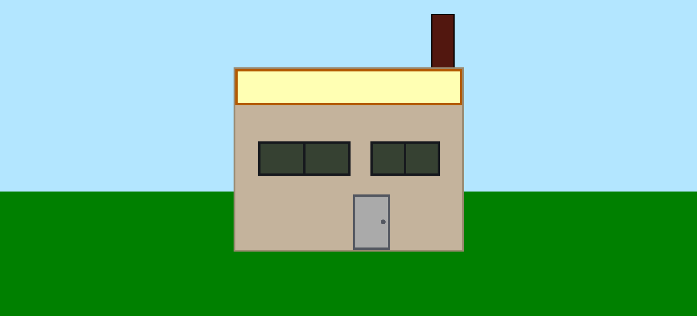

# 💻 House Painting

## ℹ️ House Layout Rendered with Pure CSS

This project is a creative visual of a house layout built entirely with semantic HTML elements and pure CSS. It demonstrates layout positioning, absolute placement, and layered background effects to create a simple house painting using code.

It was built entirely with HTML and CSS as part of the [**freeCodeCamp.org**](https://www.freecodecamp.org/learn/full-stack-developer/) CSS course.

---

## 🔍 Overview

This project visualizes a minimal house with a roof, windows, a door, and a chimney using divs styled with CSS. No images or SVGs were used—just shapes created by CSS properties like width, height, background color, and borders.

It’s a purely creative exercise meant to improve positioning, layering, and component structuring skills using only front-end code, focusing heavily on absolute positioning and z-index stacking logic.

---

## ✨ Features

- Fully hand-coded structure using semantic HTML5
- Creative rendering of a house with:
  - Chimney
  - Roof
  - Two windows with dividers
  - Door with a knob
- CSS-only layout (no images)
- Uses CSS custom properties (variables) for maintainability
- Layered backgrounds to simulate sky and grass

---

## 🧠 What I Learned

- Using absolute positioning for UI composition
- Styling components entirely with CSS
- Creating layered backgrounds with `linear-gradient`
- Applying CSS custom properties for scalable styling
- Practicing component-based layout with divs
- Structuring semantic HTML for layout-only visuals

---

## 🛠️ Tech Used

- HTML5
- CSS3
- Git
- GitHub
- Netlify

---

## 🚀 How to Run

1. Clone the repository
2. Open `index.html` in your browser

---

## 🌐 Live Demo

Or you can check out the 👉 [live website here](https://house-painting-fcc-jiro.netlify.app/)

---

## 🧑‍💻 Author

Created by **Elmar Chavez**

🗓️ Month/Year: **May 2025**

📚 Journey: **2nd** month of learning _frontend web development_.
